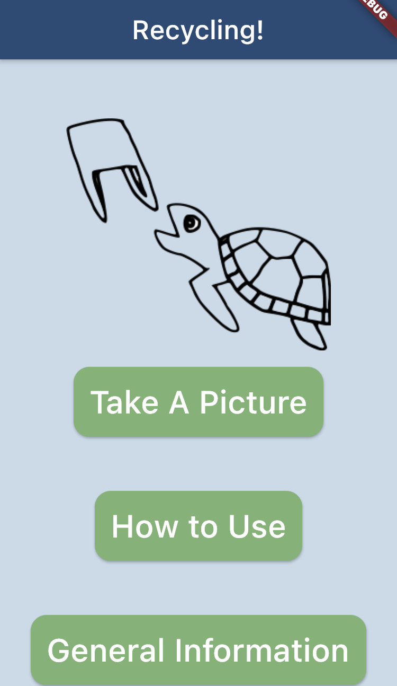
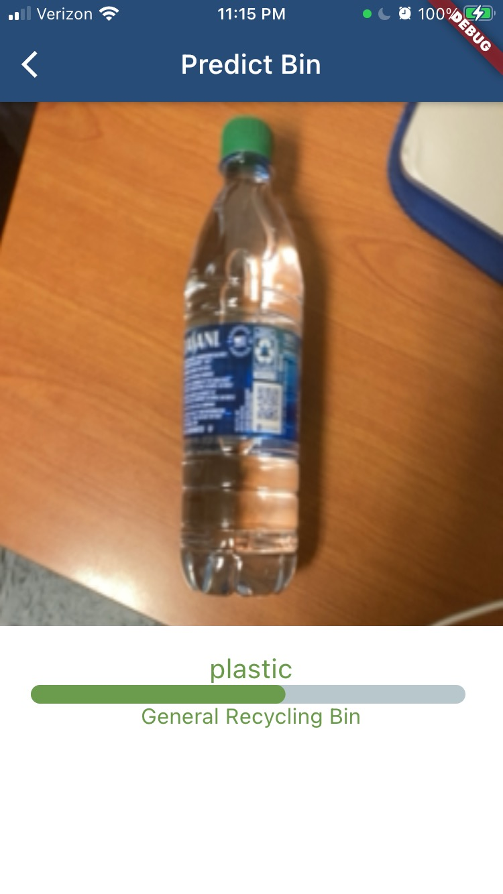
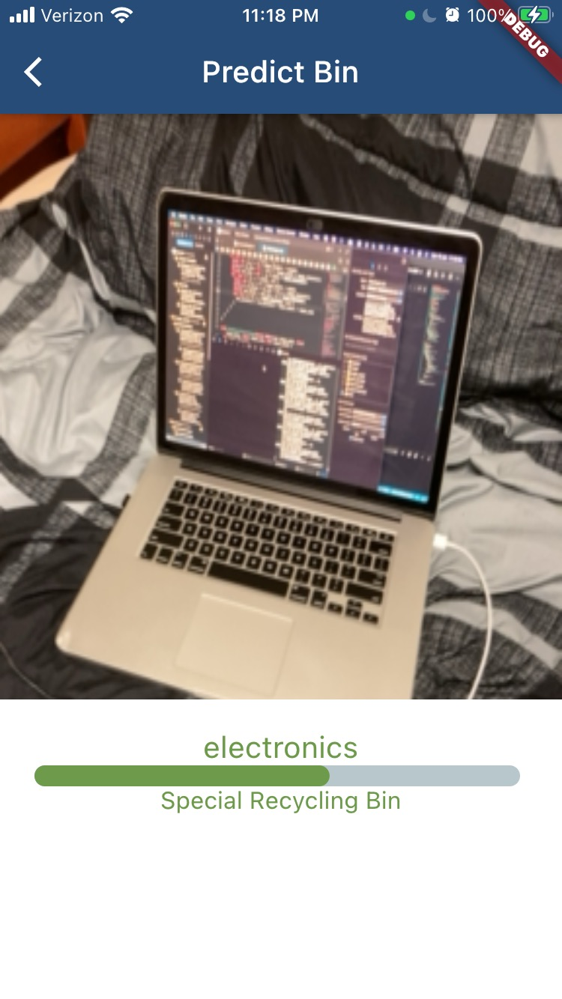
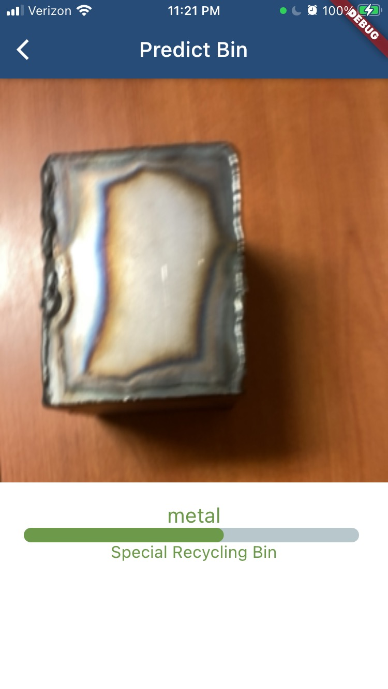
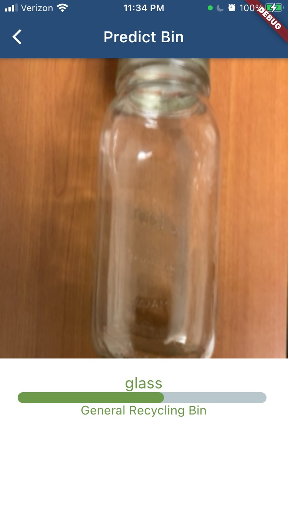
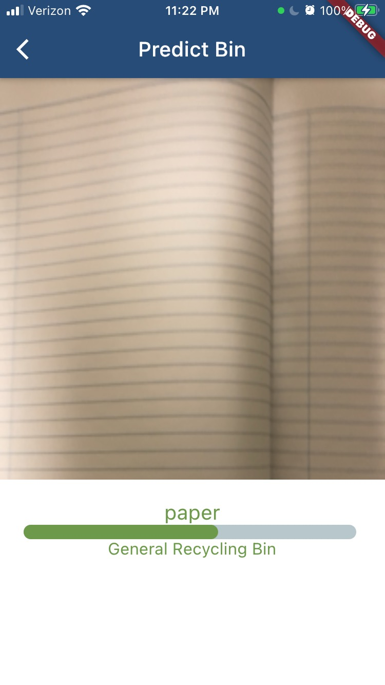
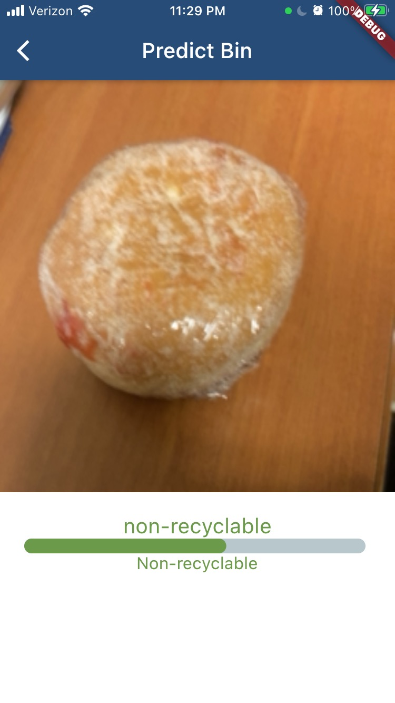

# Recycle-App

## Table of Contents

1. [Introduction](#1-introduction)

2. [Motivation](#2-motivation)

3. [Setup Mobile App](#3-setup-mobile-app-iosandroid)

    * [Run Mobile App Via Simulator](#run- mobile-app-via-simulator)

    * [Run Mobile App on Device](#run-mobile-app-on-device)

4. [App Features](#4-app-features)

5. [Tech and Framework](#tech-and-framework-used)

6. [How to Use](#how-to-use)

7. [Further Work](#further-work)

8. [References](#references)

## 1. Introduction

This is a mobile application that uses the flutter framework and dart programming language. The mobile application aims to help users seamlessly identify whether an object is recyclable and which bin to discard it into.

## 2. Motivation
We created this app as a part of the [Cisco Webex Hackathon](https://innovationchallenge.cisco.com/), but our primary motivation arose from the blatant lack of knowledge about what can be recycled, and what cannot be. When materials that cannot be recycled are placed in the recycling bin, they sometimes cannot be sorted out, and the entire batch is sent to general waste. This app is meant to serve as a solution to increase the amount recycling we do.

## 3. Setup Mobile App (ios/android)

To run the mobile app, you will need to have flutter and the respective device simulators installed. Go to [Flutter Installation Guide](https://flutter.dev/docs/get-started/install) for more details. 

### Run Mobile App via Simulator:
Once you have completed the installation, on your terminal, do
````
$ git clone git@github.com:recycle-app/recycle-app.git
````
Then change your directory to the flutter app
````
$ cd recycle-app
````
To run the app, do
```
$ flutter run
```

### Run Mobile App on Device
To access the camera feature, you need to use your phone to install the app. See [Flutter IOS App Deployment](https://flutter.dev/docs/get-started/install/macos#deploy-to-ios-devices)(ios Devices) and [Flutter Android App Deployment](https://flutter.dev/docs/get-started/install/macos#set-up-your-android-device)(Android Devices) for more details on running the app on your phone.

## 4. App Features 

Recording of Features

[](https://youtu.be/RYaHJ8xScBY)

Hover camera over the plastics:



Hover camera over electronics:



Hover camera over metal:



Hover camera over glass:



Hover camera over paper:



Hover camera over non-recyclable:



## 5. Tech and Framework Used

Mobile App:
We used [Flutter](https://flutter.dev/) to develop our application.

Deep Learning Model:
We pretrained our neural network on [Google Colab](https://colab.research.google.com/) using Tensorflow and Keras. The notebook used to trained the model has been converted into a [python file](recycle_app/lib/train.py).

Refer to [pubspec.yaml](recycle_app/pubspec.yaml) for the other libraries used.

## 6. How-to-Use
To use this app, open it, and from the home page, navigate to the camera page. There, you can take an image of whatever item you are trying to recycle. 

## 7. Further Work
Further Work:

1. To improve accuracy. The dataset that we trained our neural network on contains plenty of unclean data. For instance, among the images of the plastic bottles that we trained included birds and humans. These data were scraped 	using the Flickr API. Thus, to further increase the accuracy of predicting an object, we could either scrape more data and/or clean the current dataset that we have.
We could also add more layers as what we have comprised of a simple neural network as we didn’t have the time and resource to train the neural network for longer durations.

2. Our neural network functions such that given an image, it would predict its item type, such as plastic, glass, metal, etc., and subsequently sorts these item types and informs users which recycling bin to throw the object into. However, the limitations of such an approach is that not all plastics are recyclable in the same manner. Depending on the resin stamp (the value in the triangle symbol), a plastic may have to be thrown in certain special recycling bins or may not even be recyclable. Thus, we propose that a further work for this app would be one that prompts users what the resin stamp is whenever a plastic object is identified and informs the user which bin to throw the plastic object into respectively.

## 8. References

* [Flutter Tutorial](https://flutter.dev/docs/reference/tutorials)
* [Flutter Tensorflow Lite Deployment](https://medium.com/flutterdevs/implementing-tensorflow-lite-in-flutter-c21738e9d35c)